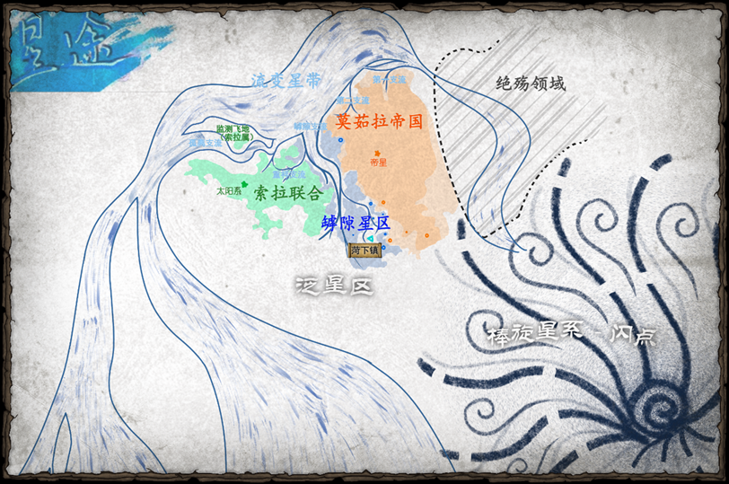

# 罅隙星区
档案组，星途测绘所
著

## 概览

### 简介

罅隙星区，在流变星带“决堤”之前，这里曾是索拉的边境星区——在索拉纪年史中，曾这样描述它：“第二索拉联合星际拓荒史上曾经最伟大的产物，是闪耀着人类开拓精神的耀眼明珠。”

但如今，经历了诸多挑战洗礼的罅隙星区已经举起自己的大旗，以其独特的优势居于两个文明的中间，又时时刻刻以勇气直面着来自流变星带的危机，向整个泛星区展现独属于他们的样貌。

### 罅隙星区的起源

#### 1. 决堤

第二索拉联合于恒星际探索和开拓举世瞩目的成就的光芒成功转移了许多原有的矛盾，掩盖住了这个过程中潜藏着的大量隐患。但当这些矛盾在索拉国内愈演愈烈，逐渐不可避免地激化、滑向一场场冲突，乃至战争——罅隙星区正是起源于这样的危机。

据后世学者考察，索拉于开拓中大量建造的跃迁空间站动摇了局部空间的稳定性，很可能诱发了流变星带的“决堤”。泛星历99年，新出现的流变星带支流径直冲刷过索拉尚未稳定的边境殖民地，奏响了索拉“破碎的星光”的序章。

在事件中，傲慢的政府错误地估计了流变星带的破坏力，认为这个小支流的出现只不过是流变星带又一次微小的异动。但“决堤”带来的灾难打了索拉政府一个措手不及，流变星带的异象导致了大量殖民地被毁灭，幸存者苟延残喘，在政府的不作为中同时面对着宇宙伟力的挑战与邻近的莫茹拉帝国虎视眈眈的眼神。不仅如此，作为“破碎的星光”的开幕序曲，这次动乱也根本性动摇了索拉政府特别是在边境的统治。

#### 2. 回潮

这片动荡的星区被那里的人们自嘲为“罅隙星区”。泛星历169年，在流变星带表现出了“回潮”的迹象后，索拉政府对这里早已完全丧失控制权，而罅隙星区的社会历经长期的剧烈演变，其中的幸存者集体的种族、文化、社会关系已然错综复杂。星区在“回潮”前后几乎全部选择独立，建立起大量依托太空城体系而存在的势力，开始对索拉和莫茹拉两国强硬地宣示自己的领土自治权力。

#### 3. 莫罅战争

两国对罅隙星区的独立极为不满：索拉意图收复自己的失地，而莫茹拉则对这片重新“失去主权”的领土及其中大量独特的技术垂涎三尺。泛星历171年，趁着索拉在“破碎的星光”后陷入内乱，莫茹拉率先出手，挑起了对罅隙星区诸多太空城势力的侵略战争。

在接触到人类以后，即使莫茹拉帝国在战争理念、战术、战略等方面已经进步不少，在开端曾将散乱无编制的敌方击得节节败退。但由于罅隙星区绵延漫长，星区状况错综复杂，前者引以为豪的母舰舰队多次被罅隙星区诸多太空城势力丰富、诡谲的战争手段击败，星区的大量领地不断易主，而莫茹拉最终在权衡利弊之后被绵延不绝的拉锯战拖出了一纸合约。在对两方战争的观望中，索拉联合国也明智地选择了合适的方针与罅隙星区诸势力共存。自此，后者在这片凶险之地才算是真正立住了脚跟。

位于罅隙星区之内的太空城包括蛛网城、迭褐，千帆过尽之地、蜮囿顶、菏下镇等。对太空诸城的相关介绍详见《罅隙星区的太空诸城》一文。

### 【附图】罅隙星区地理位置

### 【附】罅隙星区相关时间线

- 99-185年，罅隙星区起源
- 99-169年，流变星带“决堤”，当时尚为索拉边境的罅隙星区诸殖民地遭遇了长达70年的灾变
- 169-171年，流变星带“回潮”，星区诸势力在稳定之后先后宣布独立
- 171-185年，莫罅战争
  - 171年，莫茹拉帝国对罅隙星区宣战，莫罅战争爆发
  - 182年，索拉联合宣布支援罅隙星区
  - 185年，战争结束，三方签订《星区独立宪章》，罅隙星区的独立正式被泛星国际承认

## 星区诸城

### 001 蛛网城

#### 千翎

在独立前曾作为第二索拉联合在边境上最重要的壁垒城市，以“明斯之盾”的名号镇守于索拉的边陲。自回潮独立以来，蛛网城经历了多次改造与扩建，已经发展成为罅隙星区如今最大的太空城（势力），城内人类与莫茹拉人等多个种族共存，名义上由以蛛网联合为核心的诸企业实际掌权控制。

##### 城市历史

**“明斯之盾”时期**

泛星历前1年，“明斯之盾”建成。

在最初索拉联合宣布建设“明斯之盾”时，这座边境城市便被设计为一座军事级壁垒，由具备极高防御性能的城墙、能量穹顶与内部设施构成。内环为整座城市的核心，原本的中环驻守人员简单的生活需求，而再向外的区域则是相对空旷的军用缓冲环道和武装设施，用以停泊、调配军备与人员资源等。

**“决堤”时期**

泛星历99年，“决堤”的爆发横扫了整个星区，“明斯之盾”也无可幸免。这座崭新而坚固的军事堡垒可以防御侵扰的海盗、反水的叛军，甚至是来势汹汹的莫茹拉母舰舰队，但在面对自然的伟力时，再厚实的城墙和能量护盾在高能射线的面前也薄如蝉翼，再灼热的激光和电浆炮在跃迁而来的行星面前也无济于事。“明斯之盾”在天灾面前措手不及，又幸而于彻底毁灭之前及时启动了笨重的引擎，从此像边境诸多太空城一样踏上了流浪避难之旅。

索拉政府在早期便与这座城市彻底失去了联系。孤立无援的幸存难民不断寻找着机会一遍遍试图修复这座损毁严重的城市，却也一而再地遭遇新的摧残。在这不堪回首的数十年间，“明斯之盾”幸运地扛过一次次濒临坠毁的挑战，等到了流变星带罅隙支流的“回潮”，但其结构也早已变得面目全非。

在这数十年间，这片星区的一切都在飞快地变迁着。第二索拉联合彻底崩解，也标志着这片边境星区称为无主之地，又逐渐拥有了自己的称呼，罅隙星区；不断有太空城再没挺过大灾变的摧残，携着城内无数难民的灵魂消散在这片星空里，却又有无数来自各种族的新面孔，妄图在这片纷乱之地挖掘宝贵的财富；“明斯之盾”最终彻底抛弃了自己平凡、孤独的过去，在全体居民的决定下更名为“蛛网城”，并迎来了它的新统治者，也即最初的投机者，T.R.E.E.

#### “回潮”/蛛网城时期

泛星历171年，罅隙支流“回潮”，头顶的这片深邃星空重新变回了它过去那永恒而唯美的样子，但罅隙星区的一切都已经真实发生了。

蛛网城是所有幸存太空城的佼佼者。在发展机遇的刺激下，T.R.E.E.和蛛网城利用商业飞速发展的契机，自此屹立于罅隙星区之上。

### 泛蛛网城规划

（现在的）蛛网城内由三个环形部分与一个中心组成，这半悬浮的城区结构被大量如蛛网一般的交通轨道连接着；其城外公转轨道上则坐落着蛛网城的工业区，分布着大量隶属于蛛网城诸企业的工厂。

#### 气密场-循环系统

**气密场**：一种专门针对气体的弱约束力场，能够使得发生装置表面均匀地形成一定厚度的气膜层，常于太空城建设领域用于模拟大气。一般情况下，气密场约束下的气膜层可以抵抗大部分轻微的扰动。

对于蛛网城这样一个半开放式的移动太空城而言，在实现模拟大气循环的同时，尽可能减少成分丢失和维护成本变得至关重要。蛛网城最初的设计者为此专门设计了气密场-循环系统。在蛛网城建筑群墙壁均匀嵌入气密场发生装置体系，在一切表面发生足以约束一层厚约100米的气膜层存在的气密场。蛛网城的气密场还经过特殊设计，额外增强了气膜层的稳定性。在不发生重大事件的情况下，蛛网城气膜层气体的每（泛星）日泄漏率仅为0.6%。

此外，在广泛而均匀的气密场在城市表面发生后，不仅要注入合适组分的大气形成气膜层，而且由于生命活动对于大气各组分的变动，要确保完全实现功能，还需要加入循环系统。整套循环系统被内嵌在蛛网城三环的内部，大气从内环建造的送气口流出，此外还要在蛛网城的城墙内侧建造一圈抽气口，并为抽气气流设置体感阈值上下一个周期性改变的速度，能使得蛛网城气膜层中的大气像模拟的风一样在不知不觉中自内环至外环外侧循环，从而能更新补充氧气等组分，实现气膜层再循环（因此，蛛网城“风”的风向是固定的；风速的改变也有迹可循——如果有人特意注意到这一点的话）。

在蛛网城，由专门的机构负责维护系统以及采购空气组分，例如液氮、液氧等。

#### 交通

**蛛网系统**

蛛网城独具特色的交通体系，是这个城市得名“蛛网”的最大因素。

在蛛网城最初开始建设时，那位颇具天才思维的设计师在桌上拿出了属于自己的创意。这张写着“气密场循环”五个大字的灵光一现的图纸，从此彻底改变了这座城市从当时到未来的方方面面，而后续的交通设计也绕不开此种影响。由于气密场-循环系统的运转模式，传统的被广泛用于太空城的低空悬浮交通在蛛网城应用之初便被证实会对这个关键系统扰动——这个问题当然有被改良的可能性，但鉴于成本，以及一些来自于上面的独特的想法，交通公司们决定将计就计，设计出一套契合——至少表面契合——并且炫酷的新交通系统。

自此，往常在低空中能自由漂移、飙车的“私家车”在蛛网城被禁止，而大量的轨道与配套的列车则建设起来，并在此后漫长的发展中被逐渐扩增——也从规律有序的规划逐渐变为盘综错节的“蛛网”，后者导致城里的居民们将其讹称为蛛网城，并在脱离索拉联合国后彻底取代了他本来的名字。

同时，在蛛网系统上当然也行驶着少量专属列车。在蛛网城，这是一种很好的能彰显自己名声与财富的象征。

通过蛛网系统总控AI的精密调控，数量庞大的列车可以最大程度地规避一切交通风险——至少是在大多是情况下。

**飞针**

内环与部分中环，作为“上等人”的生活与工作场所，被该体系很方便地相连在一起，兼顾了效率与安全（在这个时代和这个地方也许是钻石般宝贵的东西）。而城市再靠外的城区便当然没那么便捷了，然而里面的人也偶尔需要去往外环办事，除了慢吞吞的地面交通工具之外，这时则往往需要用到一种低空工具——飞针。

这是一种在形态设计上独特到极点的交通工具，用于最大化减少对气流的扰动。飞针的整体外观就如同一个大头针，具有尖锐的头和尾部梭形的单人舱室。它本身没有任何内置的动力，在运作在蛛网轨道上的特殊列车中由斥力弹射出去，利用弹射方向与尾部三个可以用于微调方向的鳍前往目的地。在即将抵达地面时，反重力系统会帮助飞针平稳（相对）地垂直悬于地面之上。

被使用的飞针会由专门的治务所回收，确保不会被外环刁民偷窃。

### 社会基础

**呼吸**

**“冲刷” & “泥蚶” & “社会冲刷症候群”**

由于蛛网城气密场循环系统所设置的送气口与抽气口的特殊性，气膜层空气的组分会随着从内环到外环的地理位置变化而产生进行性的改变，譬如氧浓度的降低。一旦有人失去了在曾经的地方生活工作的资格，被向外驱赶，便会由于呼吸困难而变得难以适应，甚至面临窒息的危险，这种极其常见的情况被当地人称为“冲刷”，被冲刷到外环而行将就木之人，被贬称为“泥蚶”；基于这种情况在蛛网城社会所产生的诸多社会现象，被社会学家统称为“社会冲刷症候群”。

被冲刷的人，特别是“泥蚶”们，为了对抗窒息，可以选择佩戴各种装置维生，或是选择用基因工程、赛博工程等改造自身，脱离险境——当然，这一般是没有可能的。

——“蚶血鲜红”

**居留卡 & 居留税**

居留税是蛛网城居民为了继续居住在城内而必须定期上交的一种税，在此前提下居民才能够获得或一直持有凭证——居留卡。居住在不同区域的居留卡不同，被严格限定了等级，如持有外环居留卡的人无法通过正常途径进入中环甚至内环。理所当然地，持有越高等的居留卡，所需要上交的居留税自然就更多。也就是说，居留卡和居留税的制度是导致“冲刷”现象的根本原因，但也是保障蛛网城基本秩序的制度基础。

对于部分企业而言，其员工可以持有特殊的居留卡，在准入区域、居留税要求等方面有所差异。

**替换型背部呼吸器组件（“饮水机”）**

部分企业为吸氧困难的难民“暖心”提供的产品，同时也为某些需要到外环办公巡视的内环居民提供，该组件本身可供租用或购买，同时需要购买特定的液氧罐进行更换，因此被形象地称为“饮水机”。

**集气型背部呼吸器组件**：外环居民从“饮水机”私自改装而来的一系列集气型呼吸器的总称，能通过各种方式过滤并富集空气中的氧气。这种侵犯相关产业企业利益的行为很快被法律禁止，该系列装置也随之成为违禁品。

**“长堤”**

由于蛛网城特殊的气密场循环系统而在蛛网城外环外侧、城墙内侧邻近抽气口的一个特殊的环形地区。在这里，由于临近通风口，气膜层的风最为剧烈；但由于大量气体从此汇入通风口，此处的氧含量反而有所升高。正因如此，大量“泥蚶”选择在“长堤”扎营，苟延残喘。这种行为在一定程度上阻碍了大气循环，从而吸引了某些底线灵活的治务所和公司的目光。

**治务所**

在蛛网城外环中普遍存在的民间组织类型，部分治务所隶属于企业。治务所在名义上雇佣穷困潦倒的人为疏浚人，专门在长堤及周边地区打捞（可能）堵塞抽气口的物件，并将其中值钱的物件变现为财富，通常也包括流浪者或流浪者的尸体。治务所以行事原则、底线和手段的不同被分为白黑两道，前者并不会对活人下手，而视连底层人都不如的那些“泥蚶”如草芥的后者，通常就不好说了。

**疏浚人**：各治务所所雇佣的工作人员，通常都是在外环中生活并不好过的落魄者，迫于生计而急需一份用以糊口的工作。

---

### 赛博改造

在赛博改造领域，罅隙星区在独立以前便是所有人类的先驱，而在独立之后则更激进。蛛网城，则是赛博改造领域最离经叛道的忤逆者，这一切都源于一个已经被毁灭的公司——T.R.E.E。

**赛博医生**

医生这个职业的其中一个分支，专门负责赛博改造手术及所有赛博有关病症的治疗，在蛛网城拥有极高的地位。人们甚至因此看不起普通的临床医生，都说，“搭桥一连，胜医十年”，前者指的就是赛博手术中常用的人-机搭桥缓冲片。

**人-机搭桥缓冲片**：生物组织与赛博机械部件无排异性组接的必要医学部件之一。

---

### 莫茹拉人

蛛网城莫茹拉人的历史与人类有所不同。简而言之，在罅隙星区发生“决堤”之时，一部分莫茹拉投机者不速而来，或为了研究流变星带，或为了在人类难民之中发国难财。经过漫长的时间后，这些选择留在罅隙星区的莫茹拉人最终与人类社会完全交融，学会了他们的生活方式、文化与思想观念，从而定居于此。

**大环礁**

同样作为一种需氧碳基生物，莫茹拉人对氧浓度的需求较低，同时对缺氧的耐受性更差，但其原兽化后却又需要相比人类而言更高的氧浓度。由于莫茹拉人如此的独特生理特征，在历史演进中，于蛛网城生活的莫茹拉人逐渐形成了一个较为固定的聚居地，被称为大环礁。

曾经的大环礁坐落于T.R.E.E.大厦的脚下，是一片受T.R.E.E.管辖、严格限制人类进入的小城区。

在“倒树”行动中，大环礁成为了T.R.E.E.的牺牲品，基本成为遗址。

### 新环礁 & 协同广场

在“倒树”行动成功后，莫茹拉人与人类在蛛网城中的地位被重新立法商定，一个更加自由、而同时又能有效确保莫茹拉人权益的新环礁被立法设立并建设起来。

新环礁位于东南区上层中环的内侧，曾经的大环礁遗址的一部分，同时将遗址中较难清理的另一片区域设立为了公共区域，**协同广场**，用于纪念“倒树”行动的成功和人类与莫茹拉人在这次变革中做出的牺牲。

### 血石病

蛛网城的莫茹拉人特有的一种非传染性疾病。由于以慢性缺氧为核心的多种病因诱因，所导致的以细小血石结晶形成为基本病变的复杂疾病。在血石病的进程中，临床表现会从局部到全身呈现进行性发展，最后转归为外周性瘫痪、缺氧性脑死亡、病理性原兽化后多器官衰竭而死等多种结局，中晚期后较难医治。

就该病症而言，研究者目前认为慢性缺氧是导致该病发生的根本病因，而蛛网城特有的一种酒酿——跳蛛生酿中富含的酵母菌则是直接病因，此外的诱因可能包括：酒精、饮食、遗传因素、社会心理因素等等。

病理生理方面，研究推测可能是在慢性缺氧所导致的宿主生理稳态改变后，大量地、持续性地摄取这种本无害的真菌会导致它进入莫茹拉人的血液系统并不断定植（由于血液环境原因，其繁殖速率并不快），并在低氧浓度时通过复杂的生理化学反应形成极其微小的血液结晶。这种血液结晶由于过于细小而不致栓塞血管，但可能导致全身炎症（如果莫茹拉人生理情况与人类类似的话），并一定会加剧进行性的慢性缺氧情况。部分长期生活在缺氧环境下的莫茹拉人，由于各种原因，多会接触到这种风靡蛛网城的佳酿，而后开始慢性起病，同时又大多因为生活拮据不愿就医，从而病情隐秘进展导致悲剧发生。

血石病的早期局部症状因莫茹拉人从属部族不同而变化，但通常都为脆弱血管的潜在危险区由于缺氧破溃形成出血点，深蓝血液渗出并由于外界的低氧浓度而很快形成细小的海蓝色结晶，像沙一样慢慢撒出。这种点状出血很快就会凝血，但易反复发作。

血石病一旦进入进展期，治疗难度就会陡然加大。患者全身体表开始发生进行性的血石化，皮下毛细血管就算没有破溃暴露，也会开始形成血石结晶，并随着病情加重而变得更多，导致皮肤逐渐发蓝、脆化。此时，患者多种生理功能，包括内脏功能、运动和感知功能等已经开始出现障碍，但神志活动基本正常。

进展期有多种转归，包括平台期、经典晚期、爆发性转归等。

**平台期**：患者的缺氧情况保持在一个较低平衡点，病情不再恶化，但已经产生异常的生理功能很难恢复，最终大概率会导致患者外周性瘫痪。

**经典晚期**：缺氧情况继续加重，并最终导致脑缺氧，患者的神志活动开始产生障碍，并逐渐陷入昏迷，最终死亡。

**爆发性转归**：部分病例显示，少部分特殊的患者可能最终会由于体内某条神经-内分泌轴的功能失调，而导致不可控的原兽化。患者在这种破坏性的变化中会彻底失去理智，并对周围人事物产生一系列灾难性的结果。一段时间之后，患者会因为全身器官衰竭而死亡。

---

### 企业（部分）

#### T.R.E.E.

蛛网城中曾在生命工程领域占垄断性地位的大型企业，由莫茹拉人于罅隙星区诞生早期创立，后在“倒树”行动中被武力取缔。

**主丘脑**：T.R.E.E.的大型智能系统项目，意图建造并利用一种名为主丘脑的生物性的全城中枢控制整个蛛网城的一举一动，美其名曰为一种优化蛛网城管理的项目。主丘脑的建设过程血腥、残忍而完全不顾及人权，因而在阴谋暴露后直接促使蛛网城其他势力联合进行“倒树”行动，导致了T.R.E.E.的灭亡。

**抢占生存资源、就业恐慌等等因素**

**“倒树”行动**：邦德尔·科尔主导进行的全城武装行动，试图彻底摧毁T.R.E.E.及其主丘脑的残酷行径，并解救在T.R.E.E.手下受迫害的蛛网城居民。于己而言，重塑蛛网城的秩序，也是一个百年难遇的好机会。

#### 帝海力科集团

邦德尔·科尔从零开始创立的生命工程领域企业，在“倒树”行动后，通过继承T.R.E.E.的大量资源一举成为蛛网城领衔的综合集团。帝海力科现如今是蛛网联合的核心，诸企业中不可动摇的庞大势力。

**C1-1轨道化工基地**：坐落于蛛网城城外轨道的一个有机化工厂，生产范围包括各种醇类、酮类制剂等低分子有机原材料，被帝海力科集团实际控制。

**S02轨道舰船厂**：坐落于蛛网城城外轨道的一个造船厂。不同造船厂的规模、业务和控制方等均有差异。

#### 火信子重工

一个几乎垄断了罅隙星区军火制造业的大型军工企业，详见《设定档案 火信子重工》。

#### 跳蛛酒业集团

人如其名的制酒企业，旗下拥有多款广受好评的酒产品，受众广泛涵盖莫茹拉人和索拉人类，在混迹蛛网城酒吧的老饕中可谓无人不知、无人不晓。

**跳蛛生酿 & 跳蛛火酿**：这两款酒是跳蛛酒业集团的招牌，同属于一个知名度极高的烈酒系列，跳蛛经典烈酒。它们唯一的区别就在于，前者在酿造完成后，重新掺入了含有丰富的声称是来自太阳系本土的传统品种酒曲的酒糟，并进行再过筛，从而保留了包括酵母在内的多种活性成分及其所带来的独特风味；而后者则通过高温过火，在灭菌的同时催化了烈酒中多种活性物质的化学反应，“有独到的醇香感”。

跳蛛经典烈酒基本都添加了少量的成瘾剂——放心，没有人会管这个的。

### 蛛网城的核心

#### 蛛网联合

为了改善蛛网城积弊已久的垄断与恶性竞争问题，邦德尔在颇具威望后顺势主张建立的企业联合体。

> “这种模式真的能缓解垄断问题吗？”  
> “你觉得科尔先生会想不明白这么简单的事吗？”

**总部**

蛛网联合的总部大楼，悬于蛛网城中心的上方，被当地人称为“灯塔”。

**蛛网之瞳枢纽**

位于蛛网城严密保护的最中心地带，是主控太空城武器系统与推进系统的指挥中心，与总部上下相连。被当地人称为“基座”。

---

### 002 迭褐，千帆过尽之地

>>千翎

迭褐，位于罅隙星区的深处，吟游歌者口中的一座“非城之城”。它的另一个广为人知的名字叫“千帆过尽之地”，因其由无数来自于各地的、型号各异的星舰和航船所构成而得名。这座独特的城市诞生于流变星带“回潮”以后，是来自各地搜寻宝藏、追逐财富之人的“欲望的接合”。

---

### 003 蜮囿顶

>> 千翎

蜮囿顶是莫茹拉人仿制棱识高塔建造的塔形太空城，它自流变星带“回潮”以后开始屹立在罅隙星区与莫茹拉帝国的交界地，却又对外宣布独立，从不与他们的“故国”产生交流。

与罅隙星区其他太空城不同的是，蜮囿顶个性迥异，利用自己的强力武装力量严格地限制了对外的开放性，这引起了曾饱尝莫罅战争战火的罅隙星区民众的不满。但蜮囿顶不隶属于莫茹拉帝国，这使得他人纵然对帝国满怀恨意，却苦于没有借口，无从下手。更何况蜮囿顶军防严密，贸然进攻绝非明智之举。

也正是因为如此，蜮囿顶之中充斥着这帮莫茹拉人不为人知的秘密；而与之相对应的，在蜮囿顶的外部，则充溢着其他人对这座神秘之城满怀恶意、或是饱含觊觎之意的谣言。所有人都对其虎视眈眈。

---

### 004 菏下镇

>> 千翎

菏下镇是归属于星途测绘所的中立性星际空间站，位于沙晕系行星轨道，于泛星历160年始建，历时十余年建成，至今仍在不断扩建中。由于一些可以明说的个人原因，菏下镇被塑造成了一种风格独特的样式。

在建成之初，这座规模不大的空间站曾被设计仅用于满足星途所内部管理与运作职能。后经过多次扩建，逐渐对外开放，不断扩增常规职能，最终成为了一座城市级的空间站，人们在此片星区的港口，“泛星区的十字路口”。

详见《星途所-总部驻地》一文。

---

### 005 炽垒

>> 星念

第二索拉时期在罅隙星区的第二大军事基地。在决堤期间，罅隙星区大量军事基地被破坏或者被调走，炽垒的最高将领拒绝了来自望京的命令，坚持在罅隙星区各地实施救援，也因此，在很长一段时间内，被看作是罅隙星区的保护者。后面炽垒在罅隙星区的影响力和实力有所下降，但是始终是其中重要的一部分。

炽垒对外独立，为商队提供保护以及为各个势力提供调停服务，是罅隙星区的中立之地。对内，实施军事化管理，重视军工发展但是很少出口军火，不过黑市里流通着大量声称来自炽垒的军火。

炽垒是类陀螺型结构，纵轴上分为三层圆轮，中间最大而两头略小，每个圆轮自内而外分为多层，每层差速旋转以模拟重力，各自独立，这种独特的设计使得炽垒的风险承受能力极高，也因此在决堤中存活了下来。

---

### 006 下司

>> 星念

黑市集散地，位于靠近流变星带的位置，表面上看起来是一个普通的中转中心，其实在内部是罅隙星区最大的黑市。在这个地方，军方、索莫间谍、地方军阀、商盟等各个势力都在此混杂，维持着微妙又持久的平衡。在这里，有着所有你能想到或者想不到的商品和服务。

现在，下司被改造成了一个错综复杂的球形，很多特定的区域难以寻找，表面有着大量的进出口，方便各位快速跑路。下司缓慢自转提供微弱的重力，其中宽阔的通道可以通行高速飞行器。

### 007 “社稷”

>> 千翎

“社稷”，第二索拉联合时期被遗留在星区的殖民系列工程之一，是当时索拉联合著名的组织——萝拉瓦边境基金会为缓解人民食物压力而建造的巨型离心自转式农业空间站。

在罅隙星区时期后，“社稷”型农业太空站曾经历过多次改造、扩建和增建，现由“萝拉瓦基石”控制，也被人通俗地称为“大饭堂”。

关于萝拉瓦女士的相关生平，可详见《萝拉瓦——边境的最后一位理想者》。

---

### 008 “天地”

>> 千翎

“天地”，第二索拉联合时期被遗留在星区的殖民系列工程之一，是萝拉瓦边境基金会为探索稳定流变星带的方式，而设计并建造的试验性轨道设施，可惜投入巨大却收效甚微，也因此成为了基金会取缔事件的导火索。

在罅隙星区时期后，“天地”型轨道设施的项目被“萝拉瓦基石”全权保留了下来。他们正在探索萝拉瓦女士生前留下的这套理论的可能性。

---

### 009 “山川”

>> 千翎

与“社稷”“天地”不同的是，“山川”并非殖民系列工程之一，而是罅隙星区时期后，“萝拉瓦基石”为纪念萝拉瓦女士生前对边境殖民做出的杰出贡献，而延续了基金会时对殖民系列工程设施的命名方式。集团在对罅隙星区地理现状进行研究后，意图针对星区特殊情况而利用一种全新的物流和交通系统来联系整个星区，“山川”因而诞生。

“山川”巧妙地利用了部分相对规律而稳定的流变异象，以一种相对廉价而快速的手段运输人员和货物（出乎意料的是安全性也有较高的保障），而弊端则是运输时刻和时间不可控。对此，集团日前正在探索可能的稳定的异象发生时刻表。

在罅隙星区尖端技术水平不足、研究和建设资源紧缺的现状之下，“山川”无疑是一种开创性的运输系统，为星区在莫罅战争中的胜利和最终独立中起到了巨大作用。

---

### 010 独立之拳

>> 千翎

一艘在莫罅战争时期被俘获的重型战略母舰，现被改造成了一座综合军事要塞，并长久地驻扎在罅隙星区的莫茹拉侧。

看来他们完全不顾及莫茹拉人的面子。

---

### 011 萝拉瓦大厦

>> 千翎

这个看上去并不大的传统模块式空间站，是“萝拉瓦基石”总部所在。除了满足员工基本需求的衣食住行外，萝拉瓦大厦专注于集团办公的功能，并不拓展城市其他用途，基本不对外随意开放。

但有一点与该城一切从简的宗旨不同，即萝拉瓦大厦上方极其醒目的萝拉瓦女士全息雕塑——据“萝拉瓦基石”的总裁所言，这位边境的最后一位理想者值得如此。

---

### 012 破碎之城

>> 费南

破碎之城在罅隙星区的诞生时间已无从考证，世人只知晓那是硅基生物的乐园，是所有硅基生物口中“星河间的天堂”，当然他们也对义体化程度极高的其他种族表示欢迎。但出人意料的是，关于破碎之城所处的位置，却存在难以解释的移动现象。

破碎之城的城市主脑是一台集成了几乎一切功能的超级计算机，其内部结构有待考证，但以目前可公开的情报来看，其结构绝非人类简单猜想的量子基。主脑在城中被硅基居民尊称为“祂”。

---

### 013 “浪人”舰队群

>> 天天开心

徘徊在罅隙星域的舰队群，以大量中小型星舰和战机为主力，没有固定的位置和形态。星舰只要搭载“后区块链通讯协议”即可接入“浪人”的网络，只要在星舰火控计算机上运行“海盗帮2.0”插件即可加入“浪人”舰队群。注意：在距离“浪人”舰队群1光年以内的距离请保持插件和通讯协议开启，否则可能遭受集火。

“浪人”起源于一支被遗弃的莫茹拉无人巡逻舰队。当时罅隙星域新立，这支被遗弃的舰队既惹人眼红，又令人忌惮。准人类最早部分破解了这支无人舰队的敌友识别协议，利用这支舰队保护自己的商船。后来各方势力逐渐加入这支舰队，舰队群体量不断增大。形成了长5光年，直径约1光年的舰队群。

组成“浪人”的舰队势力鱼龙混杂。星匪、雇佣兵、准人类私掠船、索拉藩王流亡政府、莫茹拉通缉犯等。

**“浪人”的规矩**：
- 严禁内斗，严禁聚众斗殴，严禁决斗，严禁暗杀；
- 自由贸易，但你得自己负责；
- 另外，比较大的势力会有自己的规矩，接近他们的舰队需要遵守。有些势力则不允许外人靠近。

---

### 014 阿萨福勒，钢与火之星

#### 阿萨福勒，一座终日笼罩在火焰中的星球/城邦，也是阿萨人唯一的故乡。由于阿萨福勒并非由人类、莫茹拉人等主流种族所控制，这使得它虽然坐落于罅隙星区之中，却与外界交流甚浅。

**火之星**  
这颗与地球大小相似的星球被整整六颗比太阳更亮的恒星包围，却奇迹般地稳置在六颗恒星的引力平衡点上。造物主如此的恩赐，使其不至于四分五裂，也不至被某颗恒星吞没。尽管如此，阿萨福勒的环境之恶劣依旧远超常人所想，星球地表流淌的是岩浆而非河流，整座城邦全年无夜，恐怖的高温足以将任何没穿防护服的人烤成焦炭。

### 阿萨人

但让所有人都意料不到的是，这样的人间地狱却孕育出了具有高等智慧的生命——阿萨人。他们可能是已知宇宙间最能耐受恶劣环境的高等生物。同时，得益于母星特殊的环境，阿萨人生来就对锻造有极强的兴趣，随处可见的热源以及代代传承的锻造方法，使得他们成为了宇宙间最好的武器匠人。

阿萨人没有姓名，没有文化，整个星球的统治机关也同样简单得令人发指——一个城主府作为最高机关，下设几个机构协助，就这样统治着整颗星球。这座城市没有成文的法律，连执法机关也是凭借过去已有的裁决进行评判。

---

### 钢之星

由于阿萨福勒星系的天然屏障，无人能窥视到他们的锻造方式、技巧和图纸的秘密。无数星际旅行家慕名而来，只为在旅行前为自己求得一把防身之物，这颗星球也因此被戏称为“宇宙头号军火贩子”。但事实上，阿萨人从未设计过单兵级以上的武器，一直以往，他们设计武器的初衷都是为了在城外怪物的攻击下自保。

但这并不代表他们不具有制备超大型武器的能力。

---

### 屹立的城邦

在得到了阿萨人研制的武器后，莫茹拉帝国与索拉联合皆对其中所含的超越寻常认知的技术表现出了强烈兴趣，却苦于无法复刻。在交涉无果后，两国曾先后动用武力威慑，但结果让人瞠目结舌——莫索两国的舰队受到了相似的遭遇，因旗舰被毁而不得不停止行动，而此时他们离阿萨福勒星系甚至还有相当一段距离。尽管官方说法是撞上了巨量的小天体，但明眼人都看得出其中的原因，这座城邦也因此在黑暗森林中得以屹立至今。

除了两边虎视眈眈的巨人文明外，阿萨福勒也曾面临着来自流变星带的威胁。在恐怖的“决堤”事件发生时，位于罅隙星区的阿萨福勒被直接笼罩在这场天文级别的冲击之中，几乎无数人都开始惋惜于一个传奇文明的陨落——没有人觉得处于六颗恒星脆弱的引力平衡点的区区一颗行星能够在这种规模的扰动下幸存下来。

这同样为他们蒙上了一层神秘的面纱。

---

### 轶事：采访

阿萨福勒近年来最博人眼球的事件大概要数城主接受来自外界的采访一事了。在采访中，城主表示自己也曾试过为这座城市更换一个更高效现代的政治制度，不过在咨询了全体公民的意见后还是放弃了这个想法。

> “有些文明，即使是稳定地活着就已经拼尽全力，我们不需要这么多变动”，城主如是说。在被问到阿萨人在武器中的秘密时，城主表示：“只是旧时代的遗产被我们偶然发现并传承下去了而已，并非外界所言的神秘魔法。”记者尝试继续追问，但后续的谈话最终不了了之。但无论如何，这次简短的采访已然吊足了世人的胃口。

阿萨福勒，这座传奇般的城市在星海中已存在许久。虽然他们像许多其他行星一样面临着恒星膨胀的威胁，但最快也要几万年之后了。至少在当下，这颗钢与火之星还将存在很长一段时间，并继续为所有想前往流变星带探险的勇者们提供他们所需之物。而阿萨福勒城中熔炉的火焰与机械将不断轰鸣，直至这座从火中诞生的城邦最终回归到恒星的炽焰之中。

